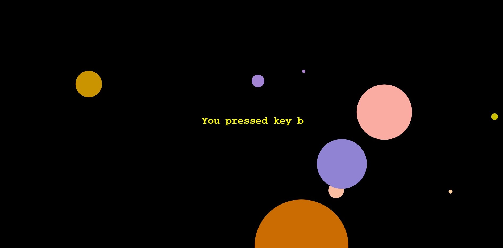

# Paper-JS-Animation

User clicks a key between a to z such that a random circle appears on the screen whose radius decreases and it ultimately diminishes from the screen. Some background sound is played whenever user clicks on a key.

## [Click to launch application] (https://paperjsbykaran.herokuapp.com/)

